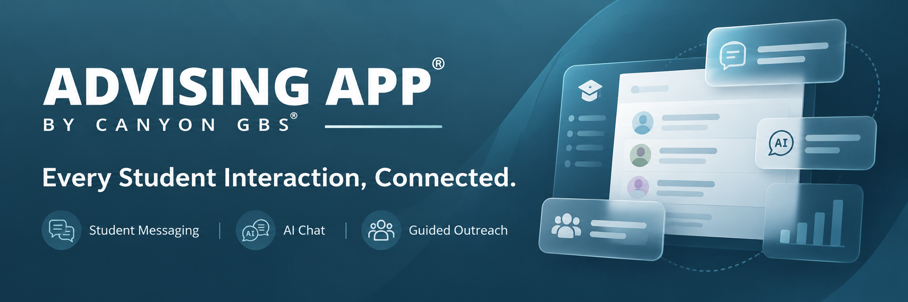

 
 

[![Contributors][contributors-shield]][contributors-url]
[![Stars][stars-shield]][stars-url]
[![License][license-shield]][license-url]

 

[**Website**](https://canyongbs.com/) ·
[**Documentation**](./docs/) ·
[**Local Setup**](./docs/how-tos/local-setup.md) ·
[**Report an Issue**](https://github.com/canyongbs/advisingapp/issues)

 

### Student engagement and relationship management in one connected platform.

Advising App® helps student-facing staff reach the right students, understand what they need, and guide every interaction toward a clear next step.

 

[**Explore the Documentation →**](./docs/) &nbsp;&nbsp;&nbsp;
[**Set Up Locally →**](./docs/how-tos/local-setup.md)

 

## Platform at a Glance

<table>
<tr>
<td width="50%" valign="top">

### Digital Engagement

#### Student Messaging

Reach students by text and email while keeping every conversation organized and searchable.

#### AI Chat

Answer routine questions around the clock with responses grounded in approved campus content.

#### Guided Outreach

Plan outreach sequences that combine messages, reminders, staff actions, and follow-up.

</td>

<td width="50%" valign="top">

### Student Relationship Management

#### Holistic Profile

See each student's records, notes, messages, tasks, and history in one place so staff can act with context.

#### Dynamic Groups

Identify priority student populations and launch targeted outreach, tasks, care team updates, and follow-up.

#### Integrated and Secure

Connect securely with campus systems while supporting SSO and enterprise security and compliance requirements.

</td>
</tr>
</table>

 

## Built for Student Success

Advising App brings communication, student context, outreach, and relationship management into one connected platform for colleges and universities.

It is designed to help teams:

- Keep student conversations organized and accessible.
- Reduce repetitive questions with AI-powered support grounded in approved content.
- Coordinate outreach across messages, reminders, tasks, and staff actions.
- Give staff a more complete view of each student.
- Identify and engage priority student populations.
- Connect with campus systems while supporting enterprise security requirements.

 

## Built With

Advising App is built on the **TALL stack** and powered by **Filament**.

 

[![Tailwind CSS][tailwind-shield]][tailwind-url]
[![Alpine.js][alpine-shield]][alpine-url]
[![Laravel][laravel-stack-shield]][laravel-url]
[![Livewire][livewire-shield]][livewire-url]
[![Filament][filament-shield]][filament-url]

 

## Get Started

To run Advising App locally, start with the [Local Setup Guide](./docs/how-tos/local-setup.md).

### Documentation

- [Local Setup](./docs/how-tos/local-setup.md)
- [Azure OpenAI Integration](./docs/how-tos/integrations/azure_open_ai.md)
- [Custom Metadata](./docs/explanations/custom-metadata.md)
- [Project Documentation](./docs/)

 

## Source Available + Managed SaaS

Advising App is developed by [Canyon GBS](https://canyongbs.com/) and is available as both source-available software and a fully managed, supported SaaS offering for colleges and universities.

The source code is distributed under the [Elastic License 2.0](./LICENSE).

 

<strong>Contributing</strong>

 

Advising App is maintained by the Canyon GBS engineering team.

Before beginning a contribution, please [open an issue](https://github.com/canyongbs/advisingapp/issues) describing the proposed feature, enhancement, or fix.

Contributions should be approved by the product team before development begins.

Once approved:

1. Fork the repository.
2. Create a feature branch.
3. Make and test your changes.
4. Rebase your branch on the latest `main` branch.
5. Open a pull request linked to the relevant issue.

 

<strong>License</strong>

 

Copyright © Canyon GBS Inc.

Advising App is source available under the [Elastic License 2.0](./LICENSE).

 

<strong>Acknowledgments</strong>

 

Special thanks to the Postsecondary Success team at the [Gates Foundation](https://www.gatesfoundation.org/our-work/programs/us-program/postsecondary-success) for supporting the creation and release of Advising App.

 

---

 

### Advising App® by [Canyon GBS®](https://canyongbs.com/)

Trusted technology for organizations that serve the public good.

 

[**Website**](https://canyongbs.com/) ·
[**LinkedIn**](https://www.linkedin.com/company/canyongbs) ·
[**Canyon GBS on X**](https://x.com/canyongbs)

 

<!-- MARKDOWN LINKS & IMAGES -->

[contributors-shield]: https://img.shields.io/github/contributors/canyongbs/advisingapp?style=flat-square&label=Contributors
[contributors-url]: https://github.com/canyongbs/advisingapp/graphs/contributors
[stars-shield]: https://img.shields.io/github/stars/canyongbs/advisingapp?style=flat-square&label=Stars
[stars-url]: https://github.com/canyongbs/advisingapp/stargazers
[license-shield]: https://img.shields.io/badge/License-Elastic%202.0-4c8da6?style=flat-square
[license-url]: https://github.com/canyongbs/advisingapp/blob/main/LICENSE
[tailwind-shield]: https://img.shields.io/badge/Tailwind_CSS-06B6D4?style=flat-square&logo=tailwindcss&logoColor=white
[tailwind-url]: https://tailwindcss.com/
[alpine-shield]: https://img.shields.io/badge/Alpine.js-8BC0D0?style=flat-square&logo=alpinedotjs&logoColor=white
[alpine-url]: https://alpinejs.dev/
[laravel-stack-shield]: https://img.shields.io/badge/Laravel-FF2D20?style=flat-square&logo=laravel&logoColor=white
[laravel-url]: https://laravel.com/
[livewire-shield]: https://img.shields.io/badge/Livewire-4E56A6?style=flat-square&logo=livewire&logoColor=white
[livewire-url]: https://livewire.laravel.com/
[filament-shield]: https://img.shields.io/badge/Filament-FDAE4B?style=flat-square&logo=filament&logoColor=black
[filament-url]: https://filamentphp.com/
