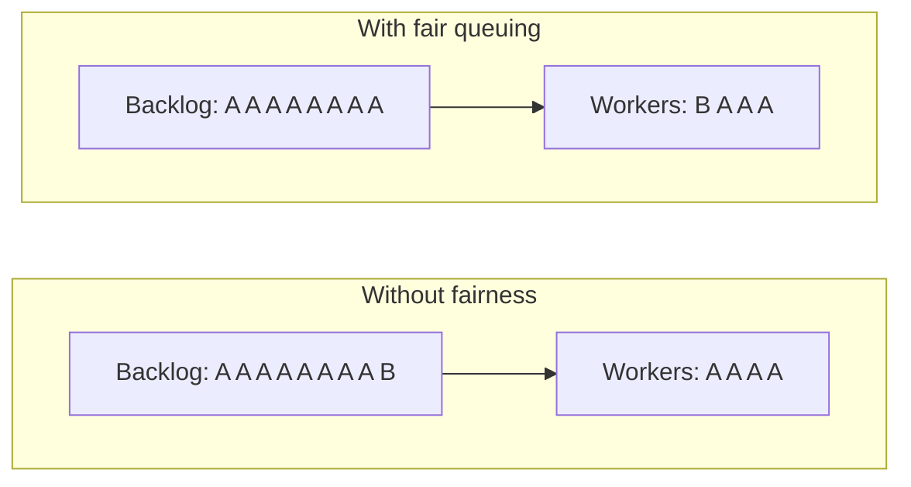
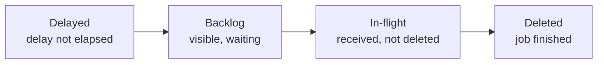

# Static Shared SQS Queues with Fair Queuing for Tenant Isolation Under Queue Autoscaling

## Context and Problem Statement

We are adding worker autoscaling and queue monitoring to Advising App using the same `cboxdk/laravel-queue-autoscale`, `cboxdk/laravel-queue-metrics`, and `cboxdk/laravel-queue-monitor` stack. Before building it, we have to decide what the queues themselves look like, because that decision shapes the driver, the infrastructure, and how tenants affect each other.

Advising App is multi-tenant (`spatie/laravel-multitenancy`). Today every tenant shares six static Amazon SQS standard queues, split by workload class:

| Queue                    | Typical work                                                    |
| ------------------------ | --------------------------------------------------------------- |
| `default`                | General tenant work                                             |
| `landlord`               | Scheduler orchestrators (`DispatchForEachTenant`), tenant setup |
| `outbound-communication` | Email/SMS delivery, notifications                               |
| `audit`                  | Audit log recording                                             |
| `meeting-center`         | Calendar sync                                                   |
| `import-export`          | Bulk imports and exports                                        |

The autoscaler supports dynamically named queues, which raised the question of whether Advising App should use one queue per tenant, either on Redis or as dynamically created SQS queues.

The concern raised by the team is the **noisy neighbor**: if one tenant (or a few) pushes a large backlog onto a shared queue, do the other tenants' jobs, queued behind that backlog, wait too long to be processed?

## Decision Drivers

- **Quiet-tenant latency**: a tenant doing normal work must not wait behind another tenant's bulk backlog.
- **Throughput and burst handling**: the system must absorb steady load and sudden bursts, from any number of tenants, by scaling workers.
- **Durability**: queued jobs must not be lost on infrastructure failure.
- **Operational simplicity**: queue infrastructure should stay declarative (IaC), not managed by application runtime code.
- **Cost**: worker memory, AWS request costs, and cache capacity.
- **Compatibility** with the cbox autoscaler/metrics/monitor packages and Laravel's queue system.
- **Migration risk** under our zero-downtime deployment model.

## Considered Options

1. Static shared SQS queues, unchanged (status quo, no fairness)
2. **Static shared SQS standard queues with SQS fair queuing (`MessageGroupId` = tenant) plus autoscaling**
3. Dynamic per-tenant SQS queues, created and deleted through the AWS SDK
4. Redis queues with dynamic per-tenant queues
5. Static shared Redis queues
6. SQS FIFO queues with `MessageGroupId` = tenant
7. Application-level per-tenant concurrency limits on shared queues (job middleware)

## Decision Outcome

Chosen option: **"Static shared SQS standard queues with SQS fair queuing plus autoscaling"** (option 2), because it directly addresses the noisy-neighbor concern at the queue service level, with no change to consumers, no per-tenant infrastructure, unlimited tenants, and no throughput ceiling, while keeping SQS's durability and the existing queue layout. Autoscaling then drains whatever backlog exists, so the noisy tenant's work also finishes as fast as capacity allows.

Concretely:

- Keep the six static SQS standard queues, split by workload class.
- Every tenant-context job carries `MessageGroupId` = the tenant's id. Laravel already sends `MessageGroupId` on standard queues when a job defines a message group; we default it to the current tenant in a small `SqsQueue` subclass so no call site changes.
- Landlord-context jobs carry no group (they are not tenant work).
- The autoscaler manages each queue with explicit per-queue entries (no wildcard patterns), scaling worker count on backlog and pickup time, and ECS scales the worker fleet on the autoscaler's demand-versus-capacity signal.
- Redis is used only for autoscaler coordination, metrics, and cache; it is never the queue.
- The queue subclass is the seam for routing a specific tenant or workload to a dedicated queue later, if hard isolation is ever required. This is not built now.

### How This Answers the Noisy-Neighbor Concern

Three layers work together:

1. **Workload separation (already in place).** The heaviest bursty work (bulk imports/exports) is on its own queue, so a 100,000-row import never sits in front of outbound email or audit writes. Fairness only has to work _within_ a workload class.
2. **Fair queuing (new).** Within a queue, when one tenant holds a disproportionate share of the in-flight messages, SQS prioritizes returning other tenants' messages. A quiet tenant's job is delivered to the next free worker instead of waiting behind the noisy tenant's backlog.
3. **Autoscaling (new).** The backlog itself drives worker count up (bounded by per-queue `workers.max` and cluster capacity, with ECS adding tasks when the cluster is out of room), so the noisy tenant's backlog drains quickly and more workers means slots free up more often for everyone else.

#### Worked example (illustrative)

Assumptions: the `default` queue, jobs averaging 2 seconds, 20 workers running. Tenant A dispatches 30,000 jobs; a moment later tenant B dispatches 1 job.

| Setup                                                | Approximate wait for tenant B's job                                      |
| ---------------------------------------------------- | ------------------------------------------------------------------------ |
| Shared queue, fixed 20 workers, no fairness          | ~30,000 × 2 s ÷ 20 ≈ **50 minutes**                                      |
| Shared queue, autoscaled to 100 workers, no fairness | ~30,000 × 2 s ÷ 100 ≈ **10 minutes**                                     |
| Shared queue with fair queuing (any worker count)    | Until the next worker frees up: ~2 s ÷ 20 ≈ **well under a few seconds** |

SQS standard queues only offer best-effort ordering, so the first two rows are approximations of "roughly at the back of the line". The numbers are illustrative; the [Confirmation](#confirmation) section describes the load test that will measure the real values.

Autoscaling alone (row 2) shortens the wait but does not remove it: it is still proportional to the noisy tenant's backlog. Fair queuing removes the dependency on the other tenant's backlog size entirely. That is why the two are combined.

### Consequences

- Good, because a quiet tenant's dwell time no longer depends on how large another tenant's backlog is.
- Good, because it requires no consumer changes, works on our existing standard queues, and has no tenant-count or throughput limit.
- Good, because queue infrastructure stays static and declarative; nothing creates or deletes AWS resources at runtime.
- Good, because SQS remains the durable store for jobs; Redis outages or throttling cannot lose queued work.
- Good, because the worker fleet is shared across all tenants: worker count scales with _work_, not with _tenant count_.
- Good, because SQS emits quiet-group CloudWatch metrics that let us verify fairness in production and alarm on the thing that matters (quiet tenants waiting).
- Bad, because isolation is soft: SQS reorders delivery but does not cap a tenant's consumption or preempt running jobs. A noisy tenant whose jobs are long-running can occupy every worker until each job finishes (see [Limits and Mitigations](#limits-and-mitigations)).
- Bad, because SQS cannot report the age of the oldest pending message through its queue API, so the autoscaler's oldest-age signal is unavailable on SQS. We compensate with the pickup-time (p95) signal and CloudWatch age metrics.
- Neutral, because per-tenant visibility comes from tagging monitored jobs with the tenant, not from per-tenant queues.

### Confirmation

1. **Code**: tenant-context jobs pushed to the `sqs` connection carry `MessageGroupId` equal to the tenant id. Covered by tests on the queue subclass (tenant default, explicit group wins, no group without a tenant).
2. **Load test in staging**: dispatch a large backlog for one tenant and a trickle for a second tenant onto the same queue (the `queue:loadtest` command gains a tenant option for this). Record pickup time per tenant from the queue monitor. Success means the quiet tenant's p95 pickup time stays within the queue's SLA while the noisy tenant's backlog drains.
3. **Production monitoring**: CloudWatch alarms on `ApproximateAgeOfOldestMessageInQuietGroups` per queue, so a single tenant's bulk work does not page anyone, but quiet tenants waiting does. `ApproximateNumberOfNoisyGroups` is graphed alongside.

## Pros and Cons of the Options

### 1. Static Shared SQS Queues, Unchanged

- Good, because there is nothing to build.
- Bad, because it is exactly the noisy-neighbor scenario the team is worried about: a quiet tenant's job waits behind the whole backlog in front of it.

### 2. Static Shared SQS Standard Queues with Fair Queuing plus Autoscaling (chosen)

See [Decision Outcome](#decision-outcome).

- Good, because fairness is provided by SQS itself, with no consumer changes and no throughput or tenant-count limits.
- Good, because Laravel supports it natively (message groups on standard queues); we only add a tenant default.
- Good, because worker count scales with total work across all tenants.
- Good, because it keeps SQS durability and the existing static infrastructure.
- Bad, because isolation is soft (reordering, not rate limiting or preemption).
- Bad, because the autoscaler loses the oldest-job-age signal on SQS (mitigated, see [More Information](#oldest-job-age-on-sqs)).

### 3. Dynamic Per-Tenant SQS Queues via the AWS SDK

Create a set of queues per tenant when the tenant is created (and for existing tenants in a migration), delete them when the tenant is deleted, and route each tenant's jobs to its own queues.

- Good, because isolation is hard: one tenant's backlog physically cannot sit in front of another's.
- Good, because per-tenant queue depth is directly visible.
- Bad, because a Laravel worker processes one queue (or a strict-priority list of queues), and the autoscaler spawns workers per queue. Every tenant queue with work needs at least one dedicated worker process (~250 MB each), so worker count and memory grow with _tenant count_, not work. Polling many queues from one worker in priority order would recreate starvation, and each empty SQS queue in the list costs a receive round trip.
- Bad, because our scheduler fans out to every tenant every minute (engagement delivery, campaign actions, workflow steps, health checks, and more), so nearly every tenant queue has work every minute. That means either a permanent warm worker per tenant queue, or constant spawn/terminate churn with a wake-up delay (an evaluation cycle plus process boot) on every tenant's first job.
- Bad, because the autoscaler's cluster leader reads depth for every queue every cycle, and Laravel's SQS driver issues three `GetQueueAttributes` calls per queue per read. With hundreds of tenants times several workload queues, that is thousands of sequential HTTP calls per 5-second cycle, which overruns the cycle and the leader lease, and a cycle that outlasts the lease makes leadership flap.
- Bad, because queue infrastructure moves from IaC into application runtime: we would own creation, dead-letter queues, redrive policies, encryption, alarms, tagging, deletion (with SQS's 60-second name-reuse delay), tenant soft-delete semantics, and `sqs:CreateQueue`/`sqs:DeleteQueue` permissions on the application's credentials.
- Bad, because migrating requires a feature-flagged cut-over where workers drain the old shared queues while new per-tenant queues come online, for every tenant.

### 4. Redis Queues with Dynamic Per-Tenant Queues

One Redis queue per tenant (`tenant-123`), discovered by the autoscaler through wildcard patterns.

- Good, because dynamic queue names cost nothing to create; the autoscaler supports glob patterns natively.
- Good, because Redis is the autoscaler's best-supported driver: true oldest-job age, reserved and delayed-due counts.
- Bad, because it has the same worker-per-queue problem as option 3: worker count grows with tenant count.
- Bad, because ElastiCache Serverless always runs in cluster mode, so each queue must be hash-tagged into a single slot. Each queue is then bound by the per-slot ceiling (30K ECPUs/second for simple SET/GET; queue operations are Lua scripts that cost more per call), and cannot scale horizontally no matter how the cache scales.
- Bad, because queue traffic is bursty and write-heavy and would compete with cache and session traffic for the same serverless scaling headroom. ElastiCache Serverless for Redis OSS can take 10 to 12 minutes to double its request rate, so a burst that outruns the ramp is throttled, along with the cache traffic on the same cache, showing up as failed writes and slow reads.
- Bad, because an in-memory cache is a weaker durability guarantee for queued work than SQS.
- Bad, because it is a full driver migration away from SQS.

### 5. Static Shared Redis Queues

- Good, because it gives the autoscaler its richest signals (true oldest-job age).
- Bad, because Redis has no fair-queuing feature, so it does not address the noisy-neighbor concern at all.
- Bad, because it carries option 4's hot-slot, shared-headroom, durability, and migration costs with none of the isolation benefit.

### 6. SQS FIFO Queues with `MessageGroupId` = Tenant

FIFO queues interleave delivery across message groups and keep strict order within each group.

- Good, because delivery naturally alternates between tenants.
- Bad, because FIFO queues do not support per-message `DelaySeconds`, and Laravel cannot delay jobs on FIFO queues. We rely on delayed dispatch and release-with-backoff.
- Bad, because strict per-tenant ordering creates head-of-line blocking _within_ a tenant: one slow or retrying job blocks that tenant's following jobs.
- Bad, because FIFO queues have throughput quotas (much higher in high-throughput mode, but still bounded), and every job needs a deduplication id.

### 7. Application-Level Per-Tenant Concurrency Limits

A job middleware (for example a Redis funnel keyed by tenant) that releases a job back to the queue when its tenant already has too many jobs running.

- Good, because it gives a hard per-tenant cap, which fair queuing does not.
- Bad, because released jobs return to the queue, burn attempts, and churn workers and SQS requests while the cap holds.
- Bad, because it adds Redis load on every job.
- Neutral, because it is the right tool for a _specific_ workload with a per-tenant downstream limit (we already do this for calendar provider concurrency), not as the global isolation strategy. It remains available alongside option 2.

## More Information

### How SQS Fair Queues Work

A message moves through these states:

- SQS continually monitors how **in-flight** messages are distributed across message groups (tenants). When one group holds a disproportionate share, it is treated as a noisy neighbor.
- Delivery from the **backlog** is then reordered to favor messages from the other groups.
- SQS does not limit a group's consumption: when there is spare consumer capacity and nothing else to deliver, the noisy tenant's messages are delivered normally. Its own dwell time stays elevated until its backlog drains.
- On standard queues, `MessageGroupId` is only a tenant identifier for fairness. It does not impose ordering (unlike FIFO queues).
- No consumer changes are needed, there is no API latency impact, and there is no limit on the number of groups.

### Limits and Mitigations

| Limit                                                                                                                                                | Mitigation                                                                                                                                                                                                                          |
| ---------------------------------------------------------------------------------------------------------------------------------------------------- | ----------------------------------------------------------------------------------------------------------------------------------------------------------------------------------------------------------------------------------- |
| Detection is based on in-flight share, so there is a short window after a burst lands before mitigation starts.                                      | The window is short relative to our SLAs; the load test measures it.                                                                                                                                                                |
| Fairness reorders delivery but does not preempt running jobs. If a noisy tenant's jobs are long, a quiet tenant waits for the next worker to finish. | Long-running bulk work is isolated on `import-export`. Autoscaling adds workers, which shortens the time until the next slot frees. A workload that needs hard isolation can be routed to its own queue through the queue subclass. |
| With very few workers (for example a floor of 1), the in-flight distribution SQS observes is coarse.                                                 | Any backlog makes the autoscaler add workers, which also improves the fairness signal.                                                                                                                                              |
| Released jobs (retry with backoff) are made invisible again rather than deleted, so they likely still count as in-flight for their tenant.           | This deprioritizes a tenant with many failing jobs, which is acceptable.                                                                                                                                                            |
| Fairness is per queue, not across queues.                                                                                                            | Workload classes are already separate queues, each autoscaled independently.                                                                                                                                                        |
| If every tenant is busy at once, there is no quiet tenant to prioritize.                                                                             | That is a capacity problem, not a fairness problem, and is what autoscaling and ECS scale-out address.                                                                                                                              |
| A tenant-specific downstream limit (an external API with per-tenant quotas) is not something fairness can enforce.                                   | Use tenant-keyed job middleware for that workload (option 7), as we already do for calendar concurrency.                                                                                                                            |

### Oldest-Job Age on SQS

The autoscaler's backlog calculation prefers a p95 pickup-time signal and falls back to the age of the oldest pending job. SQS's queue API (`GetQueueAttributes`) does not expose message age; it is only available as the CloudWatch metric `ApproximateAgeOfOldestMessage` (and `ApproximateAgeOfOldestMessageInQuietGroups` for fair queues). Laravel's SQS driver therefore reports no age, and the autoscaler falls back to draining the current backlog within one SLA window. Implementation will:

- Stamp a dispatch timestamp into job payloads so the p95 pickup-time signal works on SQS.
- Use the CloudWatch quiet-group age metric for alarms and dashboards rather than for scaling decisions, since overall oldest age on a fair queue mostly reflects the noisy tenant by design.

### References

- [Amazon SQS fair queues, SQS Developer Guide](https://docs.aws.amazon.com/AWSSimpleQueueService/latest/SQSDeveloperGuide/sqs-fair-queues.html)
- [Building resilient multi-tenant systems with Amazon SQS fair queues, AWS Compute Blog](https://aws.amazon.com/blogs/compute/building-resilient-multi-tenant-systems-with-amazon-sqs-fair-queues/)
- [aws-samples/sample-amazon-sqs-fair-queues](https://github.com/aws-samples/sample-amazon-sqs-fair-queues) (load generator and dashboard for observing fair-queue behavior)
- [Laravel queues: SQS FIFO and fair queues](https://laravel.com/docs/13.x/queues#sqs-fifo-and-fair-queues)
- [cboxdk/laravel-queue-autoscale](https://github.com/cboxdk/laravel-queue-autoscale)
- [Scaling ElastiCache Serverless](https://docs.aws.amazon.com/AmazonElastiCache/latest/dg/Scaling-serverless.html)
- [ElastiCache troubleshooting: hot slots and throttling](https://docs.aws.amazon.com/AmazonElastiCache/latest/dg/wwe-troubleshooting.html)
